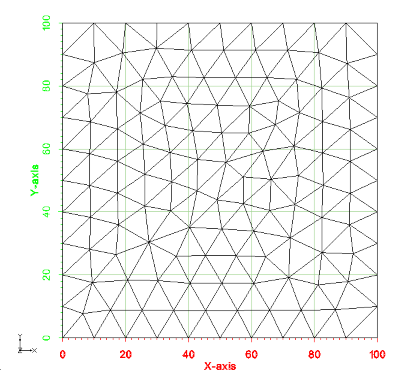
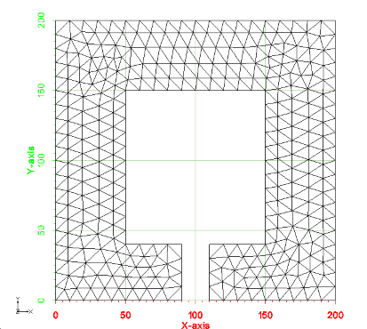
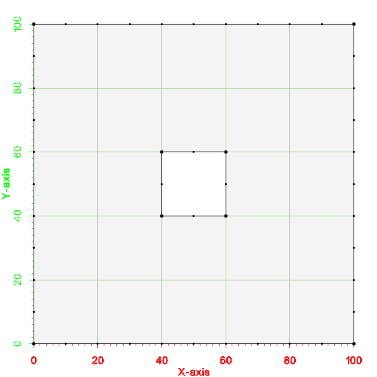
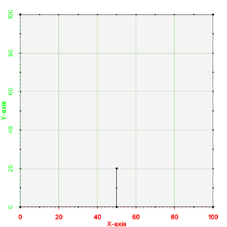
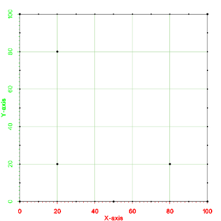
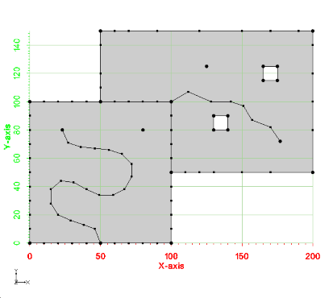
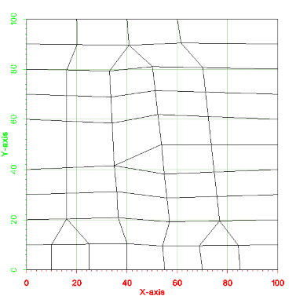

\tableofcontents
# Meshing Tutorial {#Meshing_Tutorial}

## Introduction {#Intro_Meshing}
The purpose of this tutorial is to provide explanation on how to use the classes defined in xmsmesh to generate meshes from input polygons. The examples provided in this tutorial refer to test cases that are in the xmsmesh/tutorial/TutMeshing.cpp source file.

## Example - Simple Polygon {#Example_Simple_Polygon}
This is the "hello world" example for using the meshing library.

This first example shows how to mesh a single polygon. The testing code for this example is TutMeshingTests::test_Example_SimplePolygon. A picture of the example is shown below. Notice that the polygon is a simple square from (0,0) to (100,100). Also notice that the point spacing along the boundary is a constant value of 10.

The basic steps to generate a mesh from a polygon are:
1. Define the polygon as a vector of points using the xms::MePolyInput class.
2. Add the instance of the xms::MePolyInput class to the m_polys vector of the xms::MeMultiPolyMesherInput class.
3. Pass the xms::MeMultiPolyMesherInput class to the xms::MeMultiPolyTo2dm->Generate2dm method.  This call will create an ascii file (2dm).

\snippet xmsmesh/tutorial/TutMeshing.cpp snip_test_Example_SimplePolygon

An image of the 2d mesh generated from this example is shown below. The *.2dm file for this mesh can be found at test_files/Tutorial_Meshing/Example_SimplePolygon_base.2dm.

## Example - Complex Polygon {#Example_Complex_Polygon}
This is another example of how to mesh a single polygon. The testing code for this example is TutMeshingTests::test_Example_ComplexPolygon. A picture of the example is shown below. Notice that the polygon is more complex than the first case. Similar to example 0, the point spacing along the boundary is a constant value of 10.

The same basic steps used with the simple polygon are followed for this example.

\snippet xmsmesh/tutorial/TutMeshing.cpp snip_test_Example_ComplexPolygon

An image of the 2d mesh generated from this example is shown below. The *.2dm file for this 2d mesh can be found at files_xmsmesh/Test/Tutorial_Meshing/Example_ComplexPolygon_base.2dm

## Example - Simple Polygon with a hole {#Example_Complex_Polygon_Hole}

This is another example of how to mesh a single polygon, but this polygon contains a hole. The testing code for this example is TutMeshingTests::test_Example_SimplePolygonWithHole. A picture of the example is shown below. This example still uses a constant point spacing of 10 along the boundary.
 

\snippet xmsmesh/tutorial/TutMeshing.cpp snip_test_Example_SimplePolygonWithHole

An image of the 2d mesh generated from this example is shown below. The *.2dm file for this 2d mesh can be found at files_xmsmesh/Test/Tutorial_Meshing/Example_SimplePolygonWithHole_base.2dm

## Example - Breaklines {#Example_Breaklines}
The next example has a polygon as well as a breakline. A breakline is a mulitsegment line within a polygon. The breakline may begin at one of the polygon points or it may be completely contained within the polygon. The edges of elements in the resulting mesh must conform to the segments of the breakline. The testing code for this example is TutMeshingTests::test_Example_Breakline. A picture of the example is shown below.

Breaklines can be specified as an internal polygon with a width of 0.0. The points that make up the line are pushed into a vector from the beginning point in order to the endpoint and then back in order to the point just before the beginning point (see the definition of the inner polygon in the following example).

\snippet xmsmesh/tutorial/TutMeshing.cpp snip_test_Example_Breakline

An image of the 2d mesh generated from this example is shown below. The *.2dm file for this 2d mesh can be found at files_xmsmesh/Test/Tutorial_Meshing/Example_Breakline_base.2dm

## Example - Refine Points {#Example_RefinePoints}
A refine point is a location in the mesh where the user can specify a desired element edge size. The generated mesh will have elements with the specified size surrounding the refine point. Refine points can be located at a mesh node/point (corner of a cell/element). Refine points can also be located at the center of a cell/element. A desired element edge size can also be specified with each refine point. If the size is not specified then the refine point becomes a "hard point" that is inserted as a node into the mesh. The following example includes all 3 types of refine points. The testing code for this example is TutMeshingTests::test_Example_RefinePoints. A picture of the example is shown below.

\snippet xmsmesh/tutorial/TutMeshing.cpp snip_test_Example_RefinePoints

An image of the 2d mesh generated from this example is shown below. The *.2dm file for this 2d mesh can be found at files_xmsmesh/Test/Tutorial_Meshing/Example_RefinePoints_base.2dm

## Example - Multiple Polygons with variable spacing, holes, breaklines, and refine points {#Example_MultiPolygon}
The next example has multiple polygons with variable spacing along the boundary, holes in the polygons, breaklines and refine points. The testing code for this example is TutMeshingTests::test_Example_MultiplePolygons. A picture of the example is shown below.

\snippet xmsmesh/tutorial/TutMeshing.cpp snip_test_Example_MultiPolygon

An image of the 2d mesh generated from this example is shown below. The *.2dm file for this 2d mesh can be found at files_xmsmesh/Test/Tutorial_Meshing/Example_MultiPolygon_base.2dm

## Example - Scalar Paving{#Example_ScalarPaving}
This example illustrates how to influence the size of elements in the generated 2d mesh by specifying a size function. This process is referred to as scalar paving. The size function is specified using xms::InterpBase. The InterpBase class performs spatial interpolation from points and triangles. This example uses a simple polygon with a set of 5 points and 4 triangles to define a linear size function. The testing code for this example is TutMeshingTests::test_Example_ScalarPaving. A picture of the example is shown below.

\snippet xmsmesh/tutorial/TutMeshing.cpp snip_test_Example_ScalarPaving

An image of the 2d mesh generated from this example is shown below. The *.2dm file for this 2d mesh can be found at files_xmsmesh/Test/Tutorial_Meshing/Example_ScalarPaving_base.2dm

## Example - Patch Mesh Generation {#Example_Patch}
An adaptive coons patch methodology is implemented in xmsmesh for generating triangular and quad cells. In general, a patch can be generated for a polygon with 4 sides. You can specify the four sides by indicating the indices of the points that make up the polygon corners in the xms::MePolyInput class (m_polyCorners). Below is a picture of the input for this example. Notice that the number of segments is different on each side of the polygon. The testing code for this example is TutMeshingTests::test_Example_Patch.

The following code shows how to setup the polygon corners. Note that the first point listed in the polygons is assumed to be a corner and not included in the list of corners. Thus, m_polyCorners should always be either size 0 or 3.

\snippet xmsmesh/tutorial/TutMeshing.cpp snip_test_Example_Patch

An image of the 2d mesh generated from this example is shown below. The *.2dm file for this 2d mesh can be found at files_xmsmesh/Test/Tutorial_Meshing/Example_Patch_base.2dm

## Example - Polyline point redistribution {#Example_PolyLineRedist}
Polyline redistribution can be accomplished with the xms::MePolyRedistributePts class. This class can perform redistribution once a size function is created. The simplest size function is a constant value; thus, the class has a SetConstantSizeFunc method. An xms::InterpBase class can be set as the size function by calling SetSizeFunc method. Another way to create a size function is by giving a polygon definition with the SetSizeFuncFromPoly method. The testing code for this example is in TutMeshingTests::test_Example_PolyLineRedist.

\snippet xmsmesh/tutorial/TutMeshing.cpp snip_test_Example_Redist

## Checking Meshing Input for Errors {#Check_Input}
The input to the meshing algorithm is done using the xms::MeMultiPolyMesherInput class and the input must be specified in a certain way. For example,  vectors defining outer polygons must not be empty, the first point should not be repeated as the last point, and the number of patch corners should be 0 or 3. The function MeMultiPolyMesherImpl::ValidateInput always checks the input for these simple errors before the meshing is performed. If errors are found, the mesher asserts, writes the errors to a log file, and aborts.

Additionally, no polygon should intersect with any other polygon. A check for polygon intersections can be performed if the xms::MeMultiPolyMesherInput::m_checkTopology variable is set to true. Checking for intersections can take a long time if the input includes many polygons, so this variable is false by default. Again, if errors are found, the mesher asserts, writes the errors to a log file, and aborts.

Despite these checks, it is still possible to give the mesher bad input, and additional checks could be added in the future. For example, checks that outer polygons are clockwise and inner polygons are counter-clockwise and no inner polygon is outside it's outer polygon could be added.

## Example - Smooth transition for constant size function {#Example_ConstantSmooth}
This example shows how to specify a constant size function on a polygon that will smoothly transition from the spacing of points along the boundary to the specified constant size. This is specified in the xms::MePolyInput class. The size is specified in the m_constSizeFunction variable and a bias is specified in the m_constSizeBias member. To transition as fast as possible between boundary spacing and the m_constSizeFunction set the bias to 1.0 to transition as slowly as possible set the bias to 0.0. The testing code for this example is in TutMeshingTests::test_Example_ConstantSmooth. The input polygon is shown below.

The test shows having the size transition from the boundary spacing of 10.0 to a size of 1.0 and then a second example where the size transitions to 50.

\snippet xmsmesh/tutorial/TutMeshing.cpp snip_test_Example_ConstantSmooth

An image of the two 2d meshs is shown below. The *.2dm file for the output 2d mesh can be found at files_xmsmesh/Test/Tutorial_Meshing/Example_ConstantSmooth_base.2dm and Example_ConstantSmooth1_base.2dm.

## Example - Generate size function from depth {#Example_SizeFromDepth}
This example shows how use use xms::meSizeFunctionFromDepth to generate a size function from depth measured at points. The user specifies an array of depths and a min element size and a max element size then an array is filled with the sizes. The testing code for this example is in TutMeshingTests::test_Example_SizeFuncFromDepth.

\snippet xmsmesh/tutorial/TutMeshing.cpp snip_test_Example_SizeFuncFromDepth

## Example - Smooth a size function {#Example_SmoothSizeFunc}
This example shows how to smooth a size function based on geometric proximity so that element creation from the size function will satisfy an element growth/reduction factor. For example, if a size function specifies a nodal spacing of 10 meter elements at one location and 100 meter elements at another location 20 meters away then these constraints conflict. The smoothing function can reduce the 100 or increase the 10 based on the parameters passed to the function. The testing code for this example is in TutMeshingTests::test_Example_SmoothSizeFunc.

\snippet xmsmesh/tutorial/TutMeshing.cpp snip_test_Example_SmoothSizeFunc
